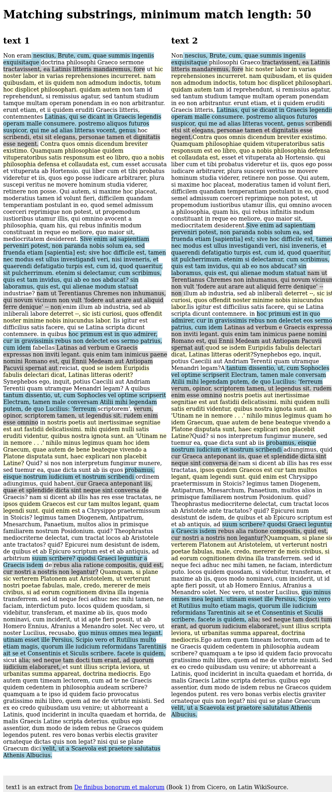

# Greedy String Tiling

This Python package implements a C++ extension of the Running Karp-Rabin Greedy String Tiling algorithm [1], which can be used for source code similarity detection as has been done with the JPlag system [2].

## Quickstart

``` Python
>>> from gst import match
>>> string_a = "lower"
>>> string_b = "yellow"
>>> minimum_match_length = 2
>>> # Find all matches of at least length 2
>>> match(string_a, '', string_b, '', minimum_match_length)
[(0, 3, 3)]
>>> assert string_a[:3] == string_b[3:3+3]
>>> # Exclude 'w' of string_a from the matches by creating an ignore mask
>>> ignore_a = '00100'
>>> match(string_a, ignore_a, string_b, '', minimum_match_length)
[(0, 3, 2)]
>>> assert string_a[:2] == string_b[3:3+2]
```
In general, ``match`` takes 5 arguments: ``string_a``, ``ignore_mask_a``, ``string_b``, ``ignore_mask_b``, ``minimum_match_length``, and produces a list of matches as 3-tuples: ``[(string_a_start_index, string_b_start_index, match_length), ...]``.

## Example

Simple [lorem ipsum example](./examples/lorem-ipsum) with matching substrings of two texts highlighted.


## Installing

Python's ``setuptools`` will take care of compiling the extension.
Just make sure the following executables can be found on your path:

* ``g++`` 5.4+
* ``python3`` 3.6+, with the development headers (e.g. the package ``python3-dev``)
* ``curl`` 7.47+
* ``tar`` 1.28+

Install without testing:
```
pip install https://github.com/Aalto-LeTech/greedy-string-tiling/archive/master.zip
```
To install some specific version, replace `master` with a desired git tag, e.g. `..-tiling/archive/0.9.0.zip`.

Install and run tests:
```
git clone --depth 1 https://github.com/Aalto-LeTech/greedy-string-tiling.git
cd greedy-string-tiling
pip install . hypothesis
python3 test.py
```

## References

[1] Wise, M.J., 1993. String similarity via greedy string tiling and running Karp-Rabin matching. Online Preprint, Dec, 119. https://www.researchgate.net/publication/262763983_String_Similarity_via_Greedy_String_Tiling_and_Running_Karp-Rabin_Matching (Accessed 24th May 2018)

[2] Prechelt, L., Malpohl, G. and Philippsen, M., 2002. Finding plagiarisms among a set of programs with JPlag. J. UCS, 8(11), p.1016. https://page.mi.fu-berlin.de/prechelt/Biblio/jplagTR.pdf (Accessed 24th May 2018)

